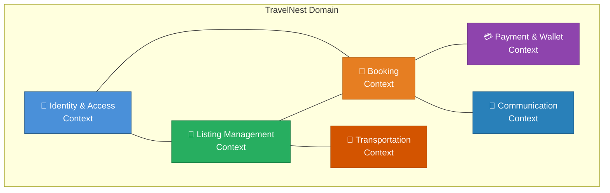
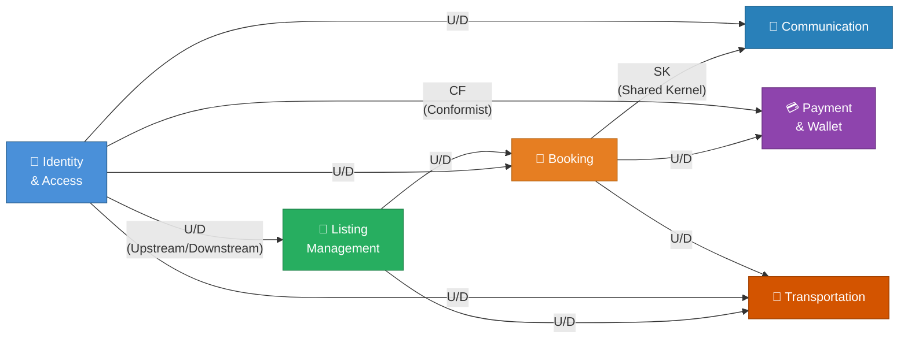
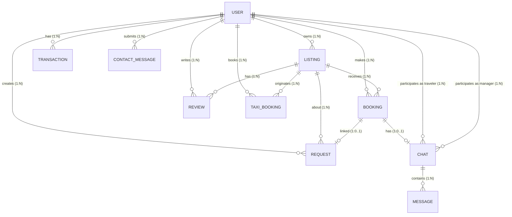

# Domain-Driven Design Document

## TravelNest — Hotel Booking & Management Platform

**Course:** Full Stack Development  
**Team Lead:** Aadesh Phadake

---

## 1. Project Title & Description

### Title
**TravelNest — A Full-Stack Hotel Booking & Management Platform**

### Brief Description (250 words)

TravelNest is a comprehensive hotel booking and management web application built using the MERN stack (MongoDB, Express.js, React, Node.js). The platform serves three primary user roles — **Travellers**, **Hotel Managers**, and **Administrators** — each with dedicated functionalities and dashboards.

**Travellers** can search and browse hotel listings with advanced filters (city, price, rating), book rooms with automated room allocation, make secure payments via Razorpay integration, write reviews, earn reward points, activate premium memberships for discounted service fees, book taxis for local transportation, and communicate with hotel managers through a real-time chat system.

**Hotel Managers** can register and manage their properties after admin approval, list hotels with room types (single/double/triple), upload images via Cloudinary, set pricing, view booking reports grouped by room type, and respond to traveller chats and service requests.

**Administrators and Staff** have a comprehensive dashboard for platform governance including user management, hotel approval/rejection workflows, booking analytics with revenue tracking, platform commission management, and staff delegation for operational tasks.

The system implements production-grade features including **Redis caching** with cache-first strategy and TTL-based invalidation, **MongoDB indexing** with text search and compound indexes for optimized queries, **JWT-based session management**, role-based access control middleware, a wallet and rewards system with transaction history, a cancellation policy with membership benefits, Swagger API documentation, Docker containerization, and a CI pipeline via GitHub Actions. The architecture follows a clean separation of concerns with dedicated routes, controllers, services, models, and middleware layers, making it scalable and maintainable for production deployment.

---

## 2. Domain-Driven Design

### 2a. Bounded Contexts

The TravelNest domain is decomposed into **six bounded contexts**, each encapsulating a distinct area of the business domain with its own ubiquitous language, models, and rules.

#### Bounded Context Descriptions

| # | Bounded Context | Responsibility | Key Domain Concepts |
|---|----------------|----------------|---------------------|
| 1 | **Identity & Access** | User registration, authentication, role management, membership, profile management, admin approval of managers | User, Role, Membership, Approval |
| 2 | **Listing Management** | Hotel CRUD, review management, search & filtering, image management, listing approval workflow, inactivity monitoring | Listing, Review, Search, Approval |
| 3 | **Booking** | Room reservation, room allocation, guest management, booking lifecycle (confirm/cancel), cancellation policies | Booking, RoomAllocation, Cancellation |
| 4 | **Payment & Wallet** | Payment processing (Razorpay), wallet balance, reward points, transaction history, refund processing | Payment, Wallet, Transaction, Refund |
| 5 | **Communication** | Traveller-manager chat per booking, contact form messages, service/complaint requests | Chat, Message, ContactMessage, Request |
| 6 | **Transportation** | Taxi booking from hotel, fare calculation, ride management | TaxiBooking, Fare, Route |

---

### 2b. Context Mappings

Context mappings define the relationships and integration patterns between bounded contexts.

#### Context Mapping Table

| Upstream Context | Downstream Context | Pattern | Description |
|-----------------|-------------------|---------|-------------|
| Identity & Access | Listing Management | **Customer/Supplier** | Listings require an authenticated User (owner). Identity context supplies User identity; Listing context consumes it. |
| Identity & Access | Booking | **Customer/Supplier** | Bookings require an authenticated Traveller. The booking context depends on user identity and membership status. |
| Listing Management | Booking | **Customer/Supplier** | Bookings reference a Listing for pricing, room types, and availability. Listing is the upstream supplier. |
| Booking | Payment & Wallet | **Customer/Supplier** | Payments are processed after booking creation. Payment context depends on booking amounts and status. |
| Booking ↔ Communication | Communication | **Shared Kernel** | Chat is created per booking. Both contexts share the Booking reference and User references as a shared kernel. |
| Identity & Access | Communication | **Customer/Supplier** | Chats and contact messages reference User identities (traveller, manager). |
| Identity & Access | Payment & Wallet | **Conformist** | Wallet balance and reward points are stored on the User model. Payment context conforms to the User model structure. |
| Listing Management | Transportation | **Customer/Supplier** | Taxi bookings originate from a Listing (hotel location as pickup). |
| Identity & Access | Transportation | **Customer/Supplier** | Taxi bookings require authenticated users. |
| Booking | Transportation | **Customer/Supplier** | Taxi rides are typically associated with a hotel stay (booking). |

---

### 2c. Entities, Value Objects, and Services

#### Context 1: Identity & Access

| Type | Name | Attributes |
|------|------|------------|
| **Entity** | User | _id, username, email, role, name, phone, address, isApproved, isMember, walletBalance, rewardPoints |
| **Value Object** | Email | String (unique, required) |
| **Value Object** | Role | Enum: traveller, manager, admin, staff |
| **Value Object** | MembershipStatus | isMember (Boolean), membershipExpiresAt (Date) |
| **Value Object** | ProfilePhoto | URL string |
| **Value Object** | ManagerDocuments | Array of document URLs |
| **Value Object** | CancellationQuota | freeCancellationsUsed (Number), freeCancellationsResetAt (Date) |
| **Service** | AuthenticationService | signup(), login(), logout(), changePassword() |
| **Service** | MembershipService | activateMembership(), checkMembershipExpiry() |
| **Service** | ManagerApprovalService | approveManager(), rejectManager(), getPendingManagers() |
| **Service** | ProfileService | updateProfile(), getCurrentUser() |

---

#### Context 2: Listing Management

| Type | Name | Attributes |
|------|------|------------|
| **Entity** | Listing | _id, title, description, price, location, country, owner, status, lastUpdated, hotelLicense, rooms |
| **Entity** | Review | _id, comment, rating, photos, author, createdAt |
| **Value Object** | Location | location (String), country (String) |
| **Value Object** | Price | Number (min: 0) |
| **Value Object** | Images | Array of URL strings (max 20) |
| **Value Object** | RoomTypes | single (Number), double (Number), triple (Number) |
| **Value Object** | ListingStatus | Enum: pending, approved, rejected |
| **Value Object** | Rating | Number (1-5) |
| **Value Object** | HotelLicense | String (license document URL) |
| **Service** | ListingCRUDService | create(), update(), delete(), getById(), getAll() |
| **Service** | SearchService | searchByText(), filterByPrice(), filterByRating(), paginatedSearch() |
| **Service** | ListingApprovalService | approveListing(), rejectListing(), getPendingListings() |
| **Service** | InactivityService | checkInactivity(), warnOwner(), autoDeleteInactive() |
| **Service** | ReviewService | createReview(), deleteReview(), sortReviews() |

---

#### Context 3: Booking

| Type | Name | Attributes |
|------|------|------------|
| **Entity** | Booking | _id, user, listing, checkIn, checkOut, guests, totalAmount, status, paymentStatus, paymentId |
| **Value Object** | DateRange | checkIn (String), checkOut (String) |
| **Value Object** | RoomAllocation | single (Number), double (Number), triple (Number) |
| **Value Object** | GuestCount | Number (min: 1, max: 5) |
| **Value Object** | BookingStatus | Enum: confirmed, cancelled |
| **Value Object** | PaymentStatus | Enum: pending, paid, refunded |
| **Value Object** | PlatformCommission | Number (5% of base amount) |
| **Value Object** | CancellationInfo | cancelledBy (user/owner/admin), cancelledAt (Date), refundId (String) |
| **Service** | BookingService | createBooking(), cancelBooking(), getBookingHistory() |
| **Service** | RoomAllocationService | allocateRooms(), restoreRooms() |
| **Service** | PricingService | calculateBaseAmount(), calculateServiceFee(), calculateTotal() |
| **Service** | CancellationService | initiateCancellation(), confirmCancellation(), processRefund() |

---

#### Context 4: Payment & Wallet

| Type | Name | Attributes |
|------|------|------------|
| **Entity** | Transaction | _id, user, type, amount, description, createdAt |
| **Value Object** | Money | Number (min: 0) |
| **Value Object** | TransactionType | Enum: earn, redeem, spend |
| **Value Object** | RazorpayOrderId | String |
| **Value Object** | RazorpayPaymentId | String |
| **Value Object** | RefundId | String |
| **Service** | PaymentGatewayService | createOrder(), verifyPayment(), processRefund() — Razorpay |
| **Service** | WalletService | getBalance(), addFunds(), deductFunds() |
| **Service** | RewardPointsService | earnPoints(), redeemPoints(), getPointsHistory() |

---

#### Context 5: Communication

| Type | Name | Attributes |
|------|------|------------|
| **Entity** | Chat | _id, booking, listing, traveler, manager, messages[], lastMessage, status |
| **Entity** | Message | _id, sender, senderRole, message, timestamp, isRead |
| **Entity** | ContactMessage | _id, name, email, subject, message, user |
| **Entity** | Request | _id, user, listing, booking, type, message, status |
| **Value Object** | MessageContent | String (trimmed, required) |
| **Value Object** | ChatStatus | Enum: open, resolved |
| **Value Object** | RequestType | Enum: service, complaint |
| **Value Object** | RequestStatus | Enum: open, in_progress, resolved |
| **Value Object** | UnreadCounts | unreadByTraveler (Number), unreadByManager (Number) |
| **Service** | ChatService | createChat(), sendMessage(), markAsRead(), getChatHistory() |
| **Service** | ContactService | submitContactForm(), getContactMessages() |
| **Service** | RequestService | createRequest(), updateRequestStatus(), getRequests() |

---

#### Context 6: Transportation

| Type | Name | Attributes |
|------|------|------------|
| **Entity** | TaxiBooking | _id, user, listing, pickupLocation, dropLocation, distanceKm, estimatedTimeMin, taxiType, fareAmount, bookingStatus |
| **Value Object** | Fare | fareAmount (Number), taxiType multiplier |
| **Value Object** | Distance | distanceKm (Number, min: 0) |
| **Value Object** | EstimatedTime | estimatedTimeMin (Number, min: 1) |
| **Value Object** | TaxiType | Enum: Standard, SUV, Luxury |
| **Value Object** | TaxiPaymentStatus | Enum: Pending, Paid, Failed |
| **Value Object** | TaxiBookingStatus | Enum: Created, Confirmed, Cancelled |
| **Service** | TaxiBookingService | createTaxiBooking(), cancelTaxiBooking(), getUserTaxiBookings() |
| **Service** | FareCalculationService | calculateFare(), applyTaxiTypeMultiplier() |

---

### 2d. Cardinality Ratios

#### Cardinality Table

| Entity A | Relationship | Entity B | Ratio | Description |
|----------|-------------|----------|-------|-------------|
| User | owns | Listing | 1 : N | One manager can own multiple hotel listings |
| User | makes | Booking | 1 : N | One traveller can make multiple bookings |
| User | writes | Review | 1 : N | One user can write multiple reviews |
| User | has | Transaction | 1 : N | One user can have multiple wallet transactions |
| User | books | TaxiBooking | 1 : N | One user can book multiple taxi rides |
| User | submits | ContactMessage | 1 : N | One user can submit multiple contact messages |
| User | creates | Request | 1 : N | One user can create multiple service requests |
| User | approved_by | User | N : 1 | Multiple managers approved by one admin |
| Listing | receives | Booking | 1 : N | One listing can have multiple bookings |
| Listing | has | Review | 1 : N | One listing can have multiple reviews |
| Listing | originates | TaxiBooking | 1 : N | Multiple taxi bookings from one hotel |
| Booking | has | Chat | 1 : 0..1 | One booking has at most one chat thread |
| Booking | linked | Request | 1 : 0..1 | One booking can have zero or one service request |
| Chat | contains | Message | 1 : N | One chat contains multiple messages |
| Review | authored_by | User | N : 1 | Multiple reviews written by same author |
| Listing | owned_by | User | N : 1 | Multiple listings owned by same manager |

---

### 2e. Aggregates

Aggregates define transactional consistency boundaries. Each aggregate has a **root entity** that controls access to all internal objects.

```mermaid
graph TB
    subgraph "User Aggregate"
        U["👤 User<br/>(Aggregate Root)"]
        U --> R["Role (VO)"]
        U --> MS["MembershipStatus (VO)"]
        U --> PP["ProfilePhoto (VO)"]
        U --> CQ["CancellationQuota (VO)"]
        U --> WB["WalletBalance (VO)"]
        U --> RP["RewardPoints (VO)"]
        U --> MD["ManagerDocuments (VO)"]
    end

    subgraph "Listing Aggregate"
        L["🏨 Listing<br/>(Aggregate Root)"]
        L --> RV["Review (Entity)"]
        L --> RT["RoomTypes (VO)"]
        L --> IMG["Images (VO)"]
        L --> LOC["Location (VO)"]
        L --> LS["ListingStatus (VO)"]
        L --> HL["HotelLicense (VO)"]
    end

    subgraph "Booking Aggregate"
        B["📅 Booking<br/>(Aggregate Root)"]
        B --> DR["DateRange (VO)"]
        B --> RA["RoomAllocation (VO)"]
        B --> GC["GuestCount (VO)"]
        B --> BS["BookingStatus (VO)"]
        B --> PS["PaymentStatus (VO)"]
        B --> PC["PlatformCommission (VO)"]
        B --> CI["CancellationInfo (VO)"]
    end

    subgraph "Chat Aggregate"
        C["💬 Chat<br/>(Aggregate Root)"]
        C --> M["Message (Entity)"]
        C --> CS["ChatStatus (VO)"]
        C --> UC["UnreadCounts (VO)"]
    end

    subgraph "Transaction Aggregate"
        T["💰 Transaction<br/>(Aggregate Root)"]
        T --> TT["TransactionType (VO)"]
        T --> MO["Money (VO)"]
    end

    subgraph "TaxiBooking Aggregate"
        TB["🚕 TaxiBooking<br/>(Aggregate Root)"]
        TB --> F["Fare (VO)"]
        TB --> D["Distance (VO)"]
        TB --> TBT["TaxiType (VO)"]
        TB --> TBS["TaxiBookingStatus (VO)"]
    end

    subgraph "ContactMessage Aggregate"
        CM["📧 ContactMessage<br/>(Aggregate Root)"]
    end

    subgraph "Request Aggregate"
        RQ["📋 Request<br/>(Aggregate Root)"]
        RQ --> RQT["RequestType (VO)"]
        RQ --> RQS["RequestStatus (VO)"]
    end

    style U fill:#4A90D9,color:#fff
    style L fill:#27AE60,color:#fff
    style B fill:#E67E22,color:#fff
    style C fill:#2980B9,color:#fff
    style T fill:#8E44AD,color:#fff
    style TB fill:#D35400,color:#fff
    style CM fill:#16A085,color:#fff
    style RQ fill:#C0392B,color:#fff
```

#### Aggregate Summary Table

| # | Aggregate | Root Entity | Internal Entities | Value Objects | Invariants |
|---|-----------|------------|-------------------|---------------|------------|
| 1 | **User** | User | — | Role, MembershipStatus, ProfilePhoto, CancellationQuota, WalletBalance, RewardPoints, ManagerDocuments | Email must be unique; walletBalance ≥ 0; rewardPoints ≥ 0; role must be valid enum |
| 2 | **Listing** | Listing | Review | RoomTypes, Images, Location, ListingStatus, HotelLicense | Max 20 images; rooms ≥ 1; price ≥ 0; status must be valid enum; auto-delete after 2 months inactivity |
| 3 | **Booking** | Booking | — | DateRange, RoomAllocation, GuestCount, BookingStatus, PaymentStatus, PlatformCommission, CancellationInfo | Guests 1-5; checkOut > checkIn; totalAmount ≥ 0; commission = 5% (0% for members) |
| 4 | **Chat** | Chat | Message | ChatStatus, UnreadCounts | One chat per booking (unique constraint); messages ordered by timestamp |
| 5 | **Transaction** | Transaction | — | TransactionType, Money | Amount ≥ 0; type must be earn/redeem/spend |
| 6 | **TaxiBooking** | TaxiBooking | — | Fare, Distance, TaxiType, TaxiBookingStatus | Distance ≥ 0; estimatedTime ≥ 1; fare follows taxi type multiplier |
| 7 | **ContactMessage** | ContactMessage | — | — | Message max 5000 chars; name and email required |
| 8 | **Request** | Request | — | RequestType, RequestStatus | Type must be service/complaint; status follows open → in_progress → resolved lifecycle |

#### Aggregate Rules

1. **All access to internal objects goes through the Aggregate Root** — e.g., Reviews are accessed through the Listing aggregate, Messages through the Chat aggregate.
2. **Cross-aggregate references use IDs only** — Booking references User._id and Listing._id, not the full objects.
3. **Each aggregate is a transactional boundary** — e.g., creating a Booking and allocating rooms is one atomic operation within the Booking aggregate.
4. **Value Objects are immutable** — Role, DateRange, Money, etc. are replaced entirely, never mutated in place.

---

## Technology Stack

| Layer | Technology |
|-------|-----------|
| Frontend | React.js (Vite) |
| Backend | Node.js + Express.js |
| Database | MongoDB Atlas |
| Caching | Redis (ioredis) |
| Payments | Razorpay |
| Image Storage | Cloudinary |
| Authentication | Passport.js (Local Strategy) |
| API Docs | Swagger UI |
| Testing | Jest + Supertest |
| Containerization | Docker |
| CI/CD | GitHub Actions |

---

*Document prepared for DDD submission — TravelNest Project*
